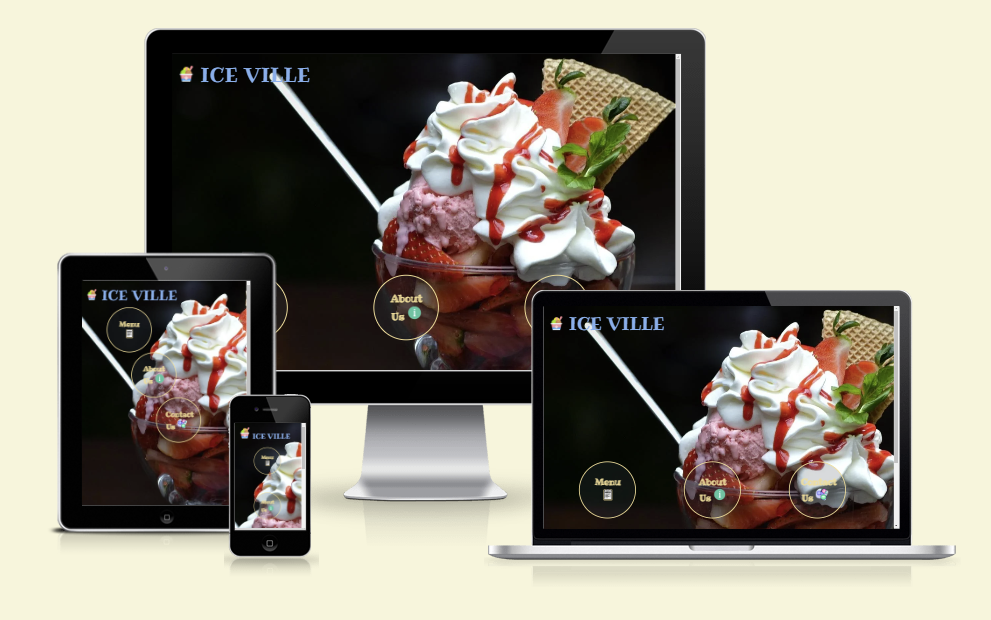
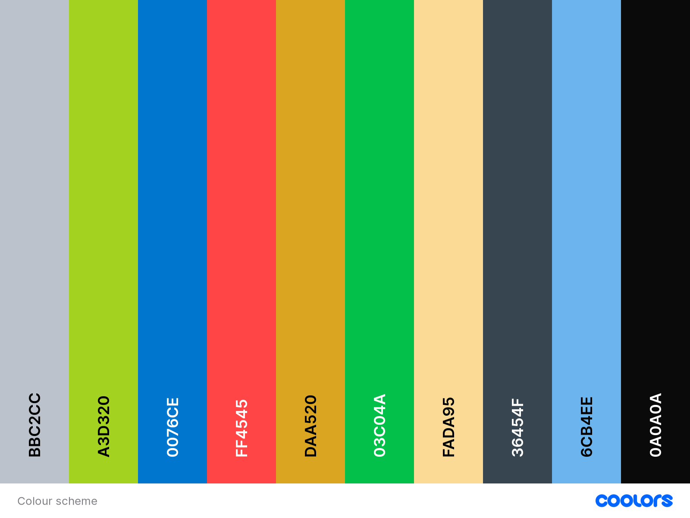
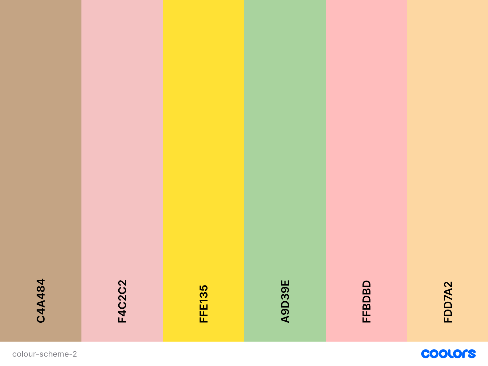
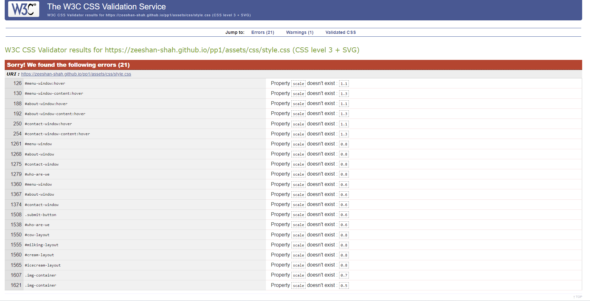
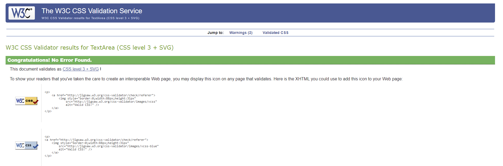
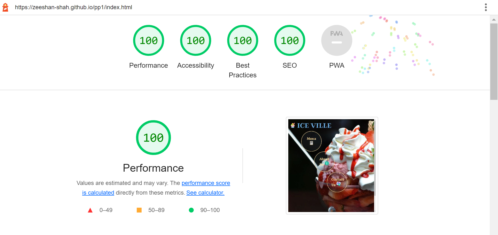
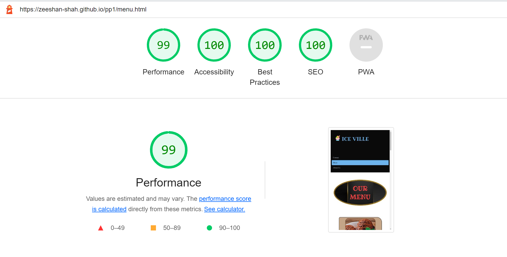
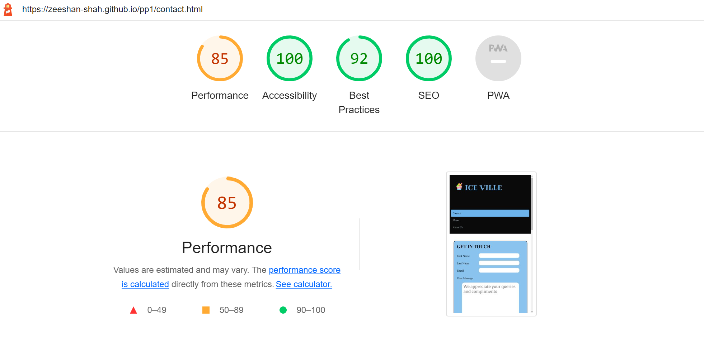
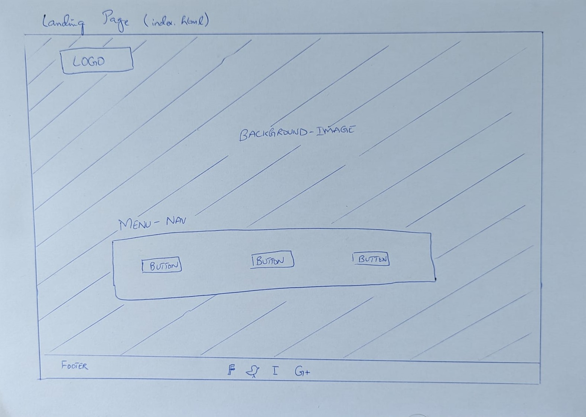
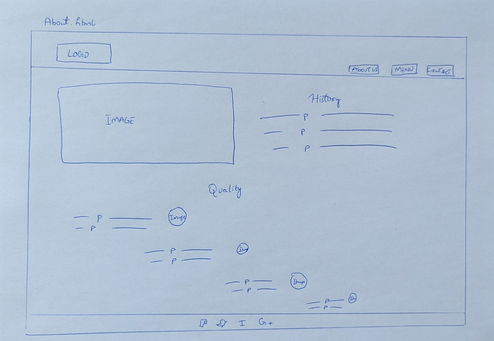

# ICE VILLE

This is my first project on HTML and CSS. After a long thought process, I decided to create a website for an ice cream parlour which is located in Le Mars, Iowa. Le Mars is known as the ice cream capital of the United States of America. 

The target audience are ice cream lovers living in and around Le Mars, Iowa.

This website is the first of five projects that must be completed in order to earn a degree in software engineering from The Code Institute.

Requirements for the project are that the website is static, responsive and uses HTML5 and CSS3.

A live version of the project can be found here:
[Project 1](https://zeeshan-shah.github.io/pp1/)

---

## Table of Content

* [User Experience](#user-experience)
    - [User Stories](#user-stories)
    - [User Goals](#user-goals)
    - [Requirements](#requirements)
* [Design](#design)
    - [Colour Scheme](#colour-scheme)
    - [Typography](#typography)
    - [Images](#images)
* [Features](#features)
    - [Index Page](#index-page)
    - [About us Page](#about-us-page)
    - [Menu Page](#menu-page)
    - [Contact Page](#contact-page)
* [Technologies Used](#technologies-used)
* [Testing](#testing)
    - [W3C Validator](#w3c-validator)
        + [HTML Validation](#html-validation)
        + [CSS Validation](#css-validation)
    - [Lighthouse](#lighthouse)
        + [Lighthouse Test - Index Page](#lighthouse-test---index-page)
        + [Lighthouse Test - About Us Page](#lighthouse-test---about-us-page),
        + [Lighthouse Test - Menu Page](#lighthouse-test---menu-page)
        + [Lighthouse Test - Contact Page](#lighthouse-test---contact-page)
* [Development and Deployment](#development-and-deployment)
    - [Development](#development)
    - [Deployment](#deployment)
* [Credits](#credits)
    - [Content](#content)
    - [Acknowledgments](#acknowledgments)
    - [Useful Sources](#useful-sources)

---

## User Experience

### User Stories

#### Existing Users

* Find new products/flavours available.
* Find new deals.
* Become a member of customer club.

#### New Users

* Find list of products available.
* Ordering facility through online or via calls.
* Find nearest parlour.
* Find contact details.

### User Goals

* Find flavours and their discription. 
* Find ordering details.
* Find parlour address.
* Find contact details.
* Contact via contact form.

### Requirements

A responsive website that offers all users the best possible user experience. A website with the best accessibility, easy to use for visually impaired people. All phases from website conception, development and deployment should be well documented and stored in GITHUB.

---

## Design

### Colour Scheme

I wanted to choose colours that reflectes the colour of an ice which has slight blue tint. I chose black for contrast. Different colors were used on the menu page to increase people's desire for a delicious ice cream. 

The colour palette was created using [Coolors](https://coolors.co/).

### Typography

Google Fonts was used to import the chosen fonts for use in the site.

I have selected multiple fonts for my project. I used the Ribeye font for my logo. This font gives my logo an extra awesome style. I used Merriweather for my headlines. It's a solid, well-constructed, legible serif and comes in a range of weights. For paragraphs, I used Inconsolata, a clean, stable font that's easy to read even at a small size. Sans serif was used as a fallback. Font weights of 300, 500 and 700 were used on the website.

### Images

The images have been appropriately chosen to showcase the colorful ice cream parlor and offer a wide variety of flavors.

Images have been resized to fit the theme and changed to .webp format for better site performance.

---

## Features

The website consists of 5 pages, the index page (landing page), the about us page, the menu page, the contact page and the feedback page.

### Index Page

The index page has a background image covers whole screen. It has logo on the top left side of the page. It contains three buttons that are anchored to pages on the website. On the bottom of the index page, the footer containing four social media links (Facebook, Twitter, Instagram and Google Plus). The code for the footer is borrowed from the [Stockin](https://codepen.io/Stockin/pen/bzdNOq).

### About Us Page

The About Us page consists of a header, a main area and a footer. The header has the logo at the top left of the page. On the right, menu items are listed horizontally for navigating to the pages of the site.

The main part of the page contains a section giving a short history of the company and a beautiful, colorful, enticing picture from outside of our parlour. At the bottom of the About Us page there is a section that gives an overview of the qualities we ensure in the manufacture and delivery of our products.

At the bottom of the About Us page is a footer with links to social media.

### Menu Page

The menu page also consists of a header, a main section, and a footer. The header is similar to the About Us page, but this time the menu anchor is active.

The main section of this page contains several blocks that describe the flavours available at Ice Ville.

There is a footer at the bottom of the page.

### Contact Page

The contact page contains all three areas as well as other pages.

The main area contains a contact form that customers can use to contact us and give us their feedback. The user will be asked to provide their full name and email address. After clicking the send button, the user will be redirected to the feedback page with a message. On the right side of the section is the location of our parlour on the Google map.

---

## Technologies Used

* HTML 
* CSS

---

## Testing

Testing continued throughout the build. I used Chrome developer tools during the build to locate and fix issues over time.

During development I used Google developer tools to make sure everything was working properly and to help troubleshoot when things weren't working as expected.

I checked each page using the Google Chrome developer tools to ensure each page is responsive on a variety of different screen sizes and devices.

During CSS validation of style.css I got some errors related to Scale property. With some help from a tutor I was successful in solving it. Instead of scale, I should have used the transform:scale() property.

The initial lighthouse test was unsatisfactory, especially in the performance class. After some research, I found that the images used on my website are in either PNG or JPG format, which is not ideal for an HTML file. So I converted them all to .webp format.

### W3C Validator

#### HTML Validation

[Index Page](https://validator.w3.org/nu/?doc=https%3A%2F%2Fzeeshan-shah.github.io%2Fpp1%2Findex.html)

[About Page](https://validator.w3.org/nu/?doc=https%3A%2F%2Fzeeshan-shah.github.io%2Fpp1%2Fabout.html)

[Menu Page](https://validator.w3.org/nu/?doc=https%3A%2F%2Fzeeshan-shah.github.io%2Fpp1%2Fmenu.html)

[Contact Page](https://validator.w3.org/nu/?doc=https%3A%2F%2Fzeeshan-shah.github.io%2Fpp1%2Fcontact.html)

#### CSS Validation

### Lighthouse

#### Lighthouse Test - Index Page

#### Lighthouse Test - About Us Page

#### Lighthouse Test - Menu Page

#### Lighthouse Test - Contact Page

The contact us page is missing the best performance rating due to some issues including importing external resources like google fonts and google map.

---

## Development and Deployment

### Development

The development of this project started with a thought process and some rough sketches of the structure of my website.

* Sketch of the Index/Landing Page:

* Sketch of the About Us Page:

Gitpod was a major player providing the development environment used for this project. To track the development phase and handle version control, regular commits and pushes were made to GitHub. The GitPod environment was built using a template provided by Code Institute.

#### Deployment

The site is deployed using GitHub Pages.

The procedure for deployment followed the "Creating your site" steps provided in [GitHub Docs](https://docs.github.com/en/pages/getting-started-with-github-pages/creating-a-github-pages-site).

1. Login or Sign Up to GitHub.
2. Open the project repository.
3. Open the project repository.
4. Click on "Pages" in the left hand navigation panel.
5. At the "Source" section choose ”main” as Branch and root as folder and click "Save".
6. The website will be deployed in few minutes and the page URL will be displayed above "Source".

---

## Credits

### Content

*  Most of the textual content on this page was created by the author of the project and is fictitious. Some text content has been taken from the external sources linked below. The people/places mentioned do not exist in real life and there is no Ice Ville.

    - [Ice cream flavours content](https://pierres.com/products/premium-ice-cream/?chocolate)
    - [Abous us](https://www.idealicecream.com/about-us/)
    - [Readme - Kera](https://github.com/kera-cudmore/readme-examples) & [Readme - Mats](https://github.com/Pelikantapeten/p1-nacka-tomato-society/blob/main/README.md)

* Icons used in the project were taken from the external source.
    - [Icons](https://www.flaticon.com/search/2?word=menu&color=color)

* Some snippets(or ideas) have been taken from the following sources.
    - [Button](https://www.w3schools.com/css/tryit.asp?filename=trycss_buttons_basic)
    - [Social media icons - Footer](https://codepen.io/Stockin/pen/bzdNOq)
    - [Image manipulation](https://linuxhint.com/css-image-size-how-to-fill-but-not-stretch/)

* The images come from various sources listed below.
    - [Dreamstime](https://www.dreamstime.com/photos-images/ice-cream.html)
    - [Pexels](https://www.pexels.com/search/ice%20cream/)
    - [Depositphotos](https://depositphotos.com/similar-images/22978426.html?offset=120)
    - [Insanely Good](https://insanelygoodrecipes.com/ice-cream-flavors/)
    - [Wallpaper Flare](https://www.wallpaperflare.com/rocambolesc-ice-cream-shop-in-barcelona-spain-sweet-colorful-wallpaper-aaqpk/download/1920x1080)

* The keywords were taken from the following sources.
    - [Twin Word](https://www.twinword.com/ideas/suggest/ice+cream/)
    - [SEO Explorer](https://seo-explorer.io/relatedkeywords/ice%20cream/)

### Acknowledgments

I would like to thank the following people:

Lauren-Nicole

* My helpful mentor at the Coding Institute who was always there to offer useful tips and constructive feedback.

Paul-Thomas

* Tutor: Thank you for the weekly meetings.

Oisin

* Tutor: Thank you for your help in fixing bugs in my code.

### Useful Sources

Websites that have provided me with information and assistance beneficial to this project:

* [W3C Schools](https://www.w3schools.com/)
* [CSS Tricks](https://css-tricks.com/snippets/css/a-guide-to-flexbox/)

The top screenshot in this ReadMe was created with:

* [Am I Responsive](https://ui.dev/amiresponsive)

Best regards,

[Ice Ville](https://zeeshan-shah.github.io/pp1/)

