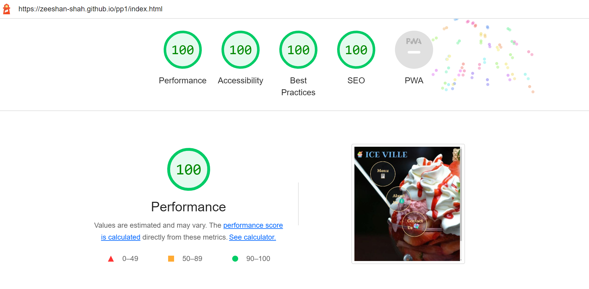
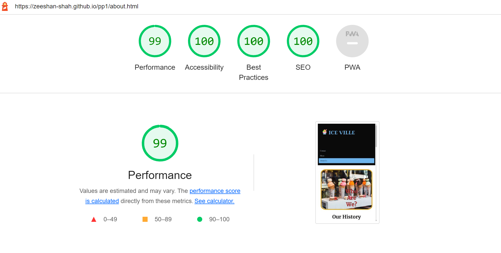

# ICE VILLE

This is my first project on HTML and CSS. After a long thought process, I decided to create a website for an ice cream parlour which is located in Le Mars, Iowa. Le Mars is known as the ice cream capital of the United States of America. 

## Table of Content
---

* [User Experience](#user-experience)
    - [User Stories](#user-stories)
    - [User Goals](#user-goals)
    - [Requirements](#requirements)
* [Design](#design)
    - [Colour Scheme](#colour-scheme)
    - [Typography](#typography)
    - [Images](#images)
* [Features](#features)
    - [Index Page](#index-page)
    - [About us Page](#about-us-page)
    - [Menu Page](#menu-page)
    - [Contact Page](#contact-page)
* [Technologies Used](#technologies-used)
* [Testing](#testing)
    - [W3C Validator](#w3c-validator)
        + [HTML Validation](#html-validation)
        + [CSS Validation](#css-validation)
    - [Lighthouse](#lighthouse)
        + [Lighthouse Test - Index Page](#lighthouse-test---index-page)
        + [Lighthouse Test - About Us Page](#lighthouse-test---about-us-page),
        + [Lighthouse Test - Menu Page](#lighthouse-test---menu-page)
        + [Lighthouse Test - Contact Page](#lighthouse-test---contact-page)
* [Development and Deployment](#development-and-deployment)
    - [Development](#development)
    - [Deployment](#deployment)
* [Credits](#credits)
    - [Content](#content)
    - [Acknowledgments](#acknowledgments)
    - [Useful Sources](#useful-sources)

## User Experience
---
### User Stories

#### Existing Users

* Find new products/flavours available.
* Find new deals.
* Become a member of customer club.

#### New Users

* Find list of products available.
* Ordering facility through online or via calls.
* Find nearest parlour .
* Find contact details.

### User Goals

* Find flavours and their discription. 
* Find ordering details.
* Find parlour address.
* Find contact details.
* Contact via contact form.

### Requirements

A responsive website that offers all users the best possible user experience. A website with the best accessibility, easy to use for visually impaired people. All phases from website conception, development and deployment should be well documented and stored in GITHUB.

## Design
---
### Colour Scheme

I wanted to choose colours that reflectes the colour of an ice which has slight blue tint. I chose black as its contrast. A bunch of different colours have been used in the menu page in order to elevate the craving for a delicious ice cream. 

The colour palette was created using [Coolors](https://coolors.co/).

### Typography

Google Fonts was used to import the chosen fonts for use in the site.

I have chosen multiple fonts for my project. I used Ribeye font for my Logo. This font gives an extra magnificent style to my logo. I have used Merriweather for my headings. It’s a solid, well constructed, legible serif and has a range of font weights available. For paragraphs, I used Inconsolata, which is a clean, stable font that reads well even in small size. Sans-Serif has been used as a fallback. Font weights of 300, 500 and 700 have been used on the website.

### Images

Images has been chosen in accordance to showcase the colourful ice cream parlour and providing a vaste range of flavours. 

Images has been sized in order to match design and has been changed to .webp format for better website performance. 

## Features
---
Thewebsite is comprised of 5 pages, the index page(landing page), about us page, menu page, contact page and the feedback page.

### Index Page

The index page has a background image covers whole screen. It has logo on the top left side of the page. It contains three buttons that are anchored to pages on the website. On the bottom of the index page, the footer containing four social media links (Facebook, Twitter, Instagram and Google Plus). The code for the footer is borrowed from the [Stockin](https://codepen.io/Stockin/pen/bzdNOq).

### About Us Page

The about us page consists of a header, main section and a footer. The header has the logo on the top left side of the page. On the right side, Menu items are listed horizontally to navigate to the pages of the website.

The main section of the page contains a section that gives a brief history of the company and a nice colorful tempting image of outside of our parlour. Down on the about us page, there is a section giving an overview of qualities that we ensure in producing and delivering our products.

At the bottom of about us page there is a footer with social media links.

### Menu Page

The menu page also comprise of a header, main section and a footer. The header section is similar to the about us page with menu anchor to be active this time.

The main section of this page contains severals blocks describing the flavours available at Ice Ville.

A footer is present at the bottom of the page.

### Contact Page

The contact page also contains all three sections as other pages. 

The main section has a contact form for the customers to contact us and give us their feedback. The user will be asked to submit their full name and email address. After clicking the send button it redirects the User to the feedback page with a message. On the right side of the section it shows our parlour location on Google map.

## Technologies Used
---
* HTML 
* CSS

## Testing
---

Testing was ongoing throughout the entire build. I utilised Chrome developer tools whilst building to pinpoint and troubleshoot any issues as I went along.

During development I made use of google developer tools to ensure everything was working correctly and to assist with troubleshooting when things were not working as expected.

I have gone through each page using google chrome developer tools to ensure that each page is responsive on a variety of different screen sizes and devices.

During the css validation of style.css, I got some errors which are related to the scale property. With some assistance from a tutor I was successful to resolve it. Instead of using scale I should have used transform:scale() property. 

The initial lighthouse test was not giving satisfactory scores especially in performance category. After some research I found the images used on my website were in either png or jpg formats, which is not ideal for a html file. Therefore I converted them all into .webp format.

### W3C Validator
---

#### HTML Validation

[Index Page](https://validator.w3.org/nu/?doc=https%3A%2F%2Fzeeshan-shah.github.io%2Fpp1%2Findex.html)

[About Page](https://validator.w3.org/nu/?doc=https%3A%2F%2Fzeeshan-shah.github.io%2Fpp1%2Fabout.html)

[Menu Page](https://validator.w3.org/nu/?doc=https%3A%2F%2Fzeeshan-shah.github.io%2Fpp1%2Fmenu.html)

[Contact Page](https://validator.w3.org/nu/?doc=https%3A%2F%2Fzeeshan-shah.github.io%2Fpp1%2Fcontact.html)

#### CSS Validation

### Lighthouse
---
#### Lighthouse Test - Index Page

#### Lighthouse Test - About Us Page

#### Lighthouse Test - Menu Page

#### Lighthouse Test - Contact Page

The contact us page lacks the best performance rating due to a few issues including importing external resources like google fonts and the google map.

## Development and Deployment
---

### Development

The development of this project started with a thought process and some rough sketches of the structure of my imagined website. 

* Sketch of the Index/Landing Page:

* Sketch of the About Us Page:

Gitpod was a major player providing the development environment used for this project. To track the development phase and handle version control, regular commits and pushes were made to GitHub. The GitPod environment was built using a template provided by Code Institute.

#### Deployment

The site is deployed using GitHub Pages.

The procedure for deployment followed the "Creating your site" steps provided in [GitHub Docs](https://docs.github.com/en/pages/getting-started-with-github-pages/creating-a-github-pages-site).

1. Login or Sign Up to GitHub.
2. Open the project repository.
3. Open the project repository.
4. Click on "Pages" in the left hand navigation panel.
5. At the "Source" section choose ”main” as Branch and root as folder and click "Save".
6. The website will be deployed in few minutes and the page URL will be displayed above "Source".

## Credits
---

### Content

*  Most of the textual content on this page was created by the author of the project and is fictitious. Some text content has been taken from the external sources linked below. The people/places mentioned do not exist in real life and there is no Ice Ville.

    - [Ice cream flavours content](https://pierres.com/products/premium-ice-cream/?chocolate)
    - [Abous us](https://www.idealicecream.com/about-us/)
    - [Readme - Kera](https://github.com/kera-cudmore/readme-examples) & [Readme - Mats](https://github.com/Pelikantapeten/p1-nacka-tomato-society/blob/main/README.md)

* Icons used in the project were taken from the external source.
    - [Icons](https://www.flaticon.com/search/2?word=menu&color=color)

* Some snippets(or ideas) have been taken from the following sources.
    - [Button](https://www.w3schools.com/css/tryit.asp?filename=trycss_buttons_basic)
    - [Social media icons - Footer](https://codepen.io/Stockin/pen/bzdNOq)
    - [Image manipulation](https://linuxhint.com/css-image-size-how-to-fill-but-not-stretch/)

* The images come from various sources listed below.
    - [Dreamstime](https://www.dreamstime.com/photos-images/ice-cream.html)
    - [Pexels](https://www.pexels.com/search/ice%20cream/)
    - [Depositphotos](https://depositphotos.com/similar-images/22978426.html?offset=120)
    - [Insanely Good](https://insanelygoodrecipes.com/ice-cream-flavors/)
    - [Wallpaper Flare](https://www.wallpaperflare.com/rocambolesc-ice-cream-shop-in-barcelona-spain-sweet-colorful-wallpaper-aaqpk/download/1920x1080)

* The keywords were taken from the following sources.
    - [Twin Word](https://www.twinword.com/ideas/suggest/ice+cream/)
    - [SEO Explorer](https://seo-explorer.io/relatedkeywords/ice%20cream/)

### Acknowledgments

I would like to thank the following people:

Lauren-Nicole

* My helpful mentor at the Coding Institute who was always there to offer useful tips and constructive feedback.

Paul-Thomas

* Tutor: Thank you for the weekly meetings.

Oisin

* Tutor: Thank you for your help in fixing bugs in my code.

### Useful Sources

Websites that have provided me with information and assistance beneficial to this project:

* [W3C Schools](https://www.w3schools.com/)
* [CSS Tricks](https://css-tricks.com/snippets/css/a-guide-to-flexbox/)

The top screenshot in this ReadMe was created with:

* [Am I Responsive](https://ui.dev/amiresponsive)

Best regards,

[Ice Ville](https://zeeshan-shah.github.io/pp1/)

